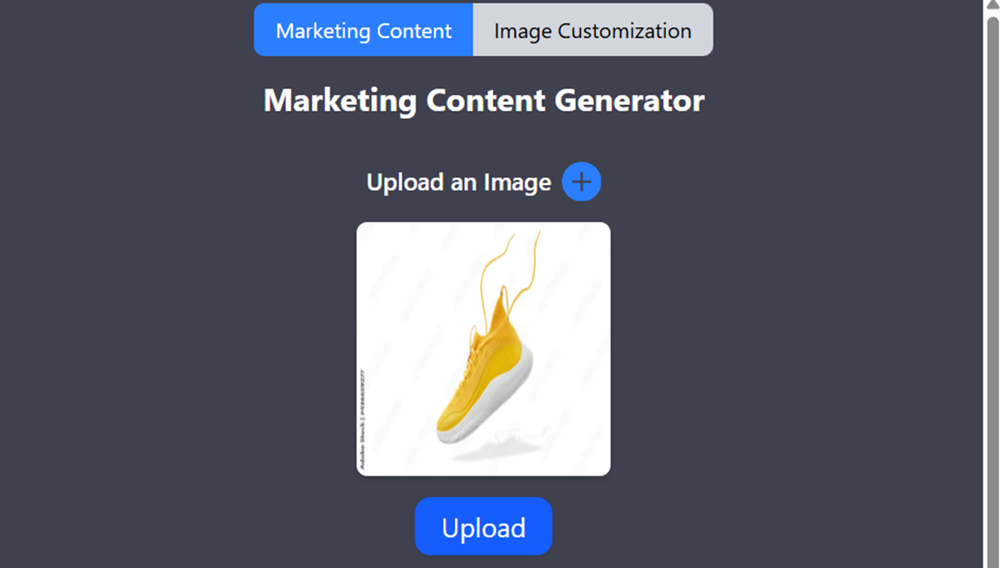
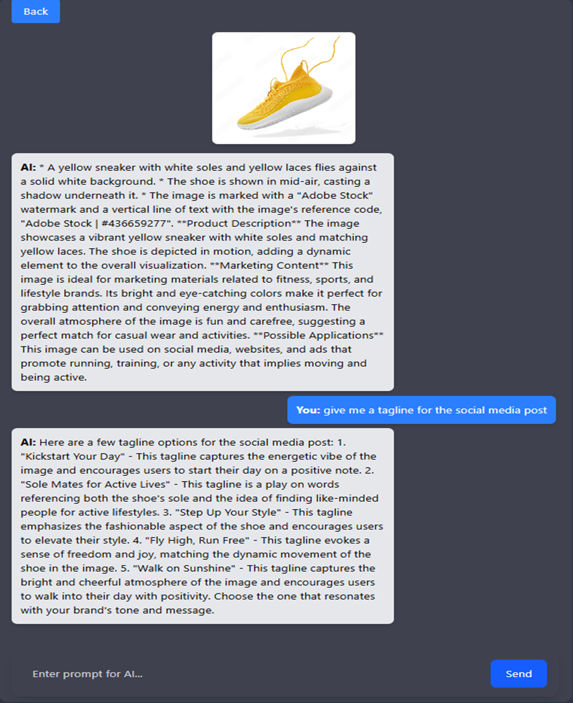
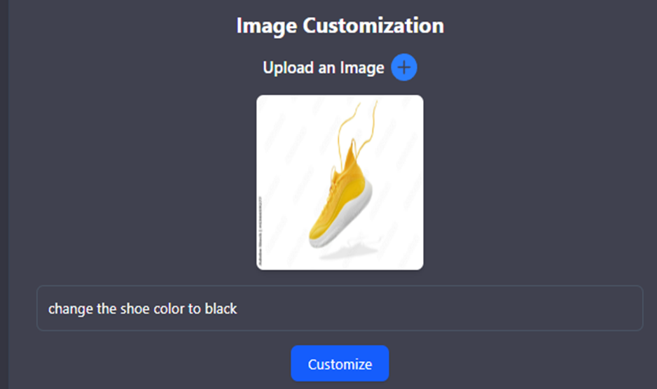
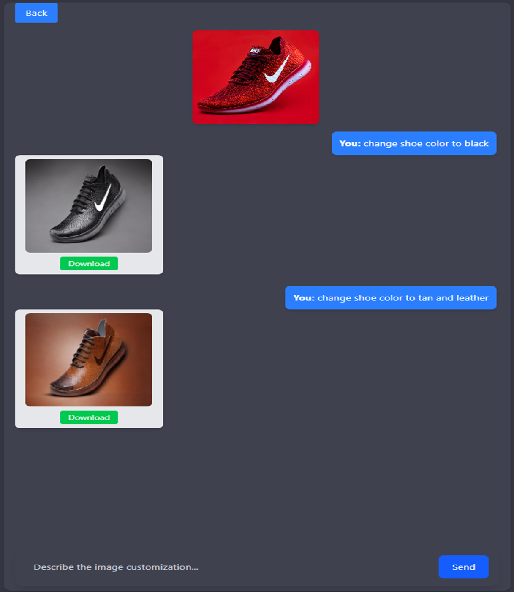

# AI-Powered Multimodal Marketing Content Generator with Customizable Product Visualization

## 📌 Project Overview

This project automates the creation of marketing content by combining advanced AI for both text and image generation. It enables users to upload product images, generate marketing descriptions, and create visually customized product variations — all from an intuitive web interface.

## ⚙️ Features

- 🖼️ **Image Upload & Product Analysis**  
  Upload product images and extract marketing content using LLaMA-4 Vision.

- 💬 **AI Marketing Chat Assistant**  
  Chat with an AI assistant to refine product messaging and content.

- 🎨 **Image Customization**  
  Use Stable Diffusion + ControlNet to apply creative customizations to product images.

- 📦 **Chat & Customization History**  
  Save, review, and download past marketing sessions and image customizations.

## 🏗️ Architecture

- **Frontend**  
  React, Tailwind CSS, Axios  
  Components: ChatInterface, PictureProcessing, ImageCustomization, Sidebar, MessageInput

- **Backend**  
  Flask, Flask-CORS, MongoDB  
  API Endpoints:  
  `/upload_image`, `/chat`, `/save_customization`, `/get_chat/<user_id>`, `/get_all_chats`, `/customize`, `/get_customization_chain/<customization_id>`, `/get_all_customizations`

- **AI Models**  
  LLaMA-4 Vision (Groq API) → text generation  
  Stable Diffusion + ControlNet (Canny edges) → image customization

- **Deployment**  
  Cloudflare Tunnel for secure backend exposure

## 🚀 Setup Instructions

### Backend Setup

\`\`\`bash
pip install diffusers transformers accelerate torch flask flask-cors opencv-python numpy
\`\`\`

Run Flask server:

\`\`\`bash
python backend.py
\`\`\`

Start Cloudflare tunnel:

\`\`\`bash
./cloudflared tunnel --url http://localhost:5000
\`\`\`

### Frontend Setup

\`\`\`bash
npm install
npm start
\`\`\`

## 📸 Screenshots

| Image Upload & Marketing                    | Marketing Chat                              | Image Customization                         | Download Customized Image                   |
| ------------------------------------------- | ------------------------------------------- | ------------------------------------------- | ------------------------------------------- |
|  |  |  |  |

## 💡 Future Improvements

- Add style templates and branding options
- Enable multi-language content generation
- Integrate A/B testing and performance analytics

## 📄 License

This project is licensed under the MIT License.
